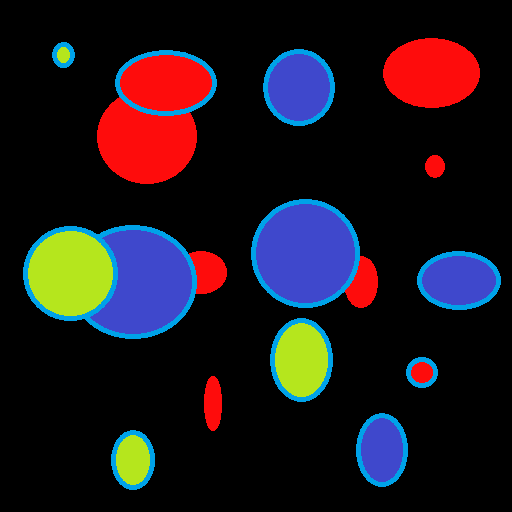
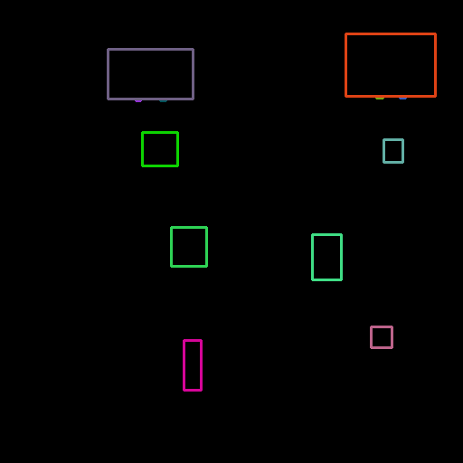
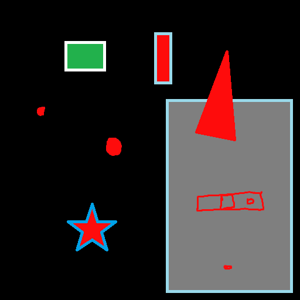
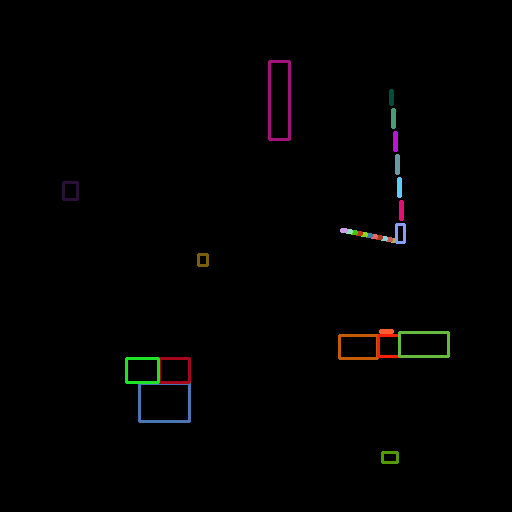
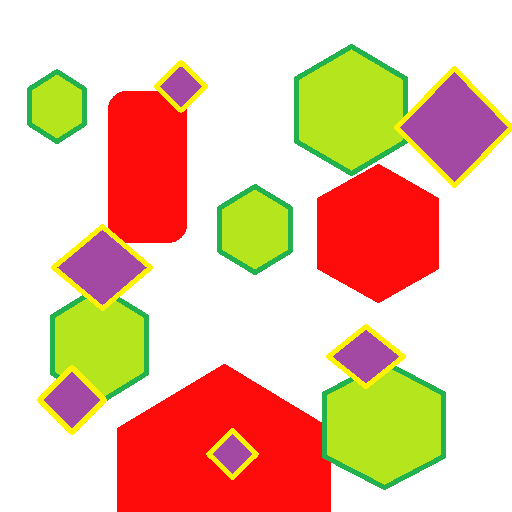
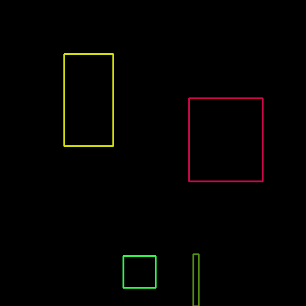
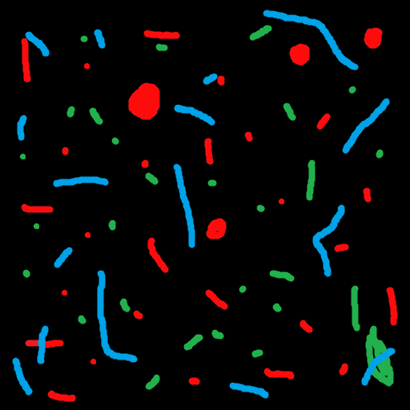
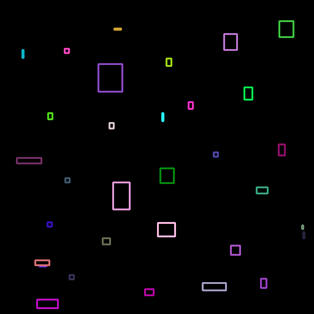

# BoundingBoxFromSegmentationMap

Generates bounding box annotations from segmentation maps for computer vision.  Capable of generating bounding boxes even if multiple of the same class in the image.  

   

   

   

Examples.  Set to look for red objects.  See limitations below.

#1) Gets images from a folder (segmentation or id maps) 

#2) Generates bounding boxes of the form x1, y1, x2, y2 for upright bounding boxes (bottem left coordinate and top right coordinate in pixels 

#3) Saves data to csv file 

#4) Displays the sources and bounding box images (optional) 

#5) Saves the bounding box images to file (optional)

##limitations:
#only segments one colour at a time, but could be adapted if you want
#if instances of a colour/class in a segmentation image are too close together such that their bounding boxes would overlap, then only one of them is detected/recorded

The code borrows heavily from 
https://docs.opencv.org/3.4/da/d0c/tutorial_bounding_rects_circles.html

And also from
https://stackoverflow.com/questions/25349178/calculating-percentage-of-bounding-box-overlap-for-image-detector-evaluation
